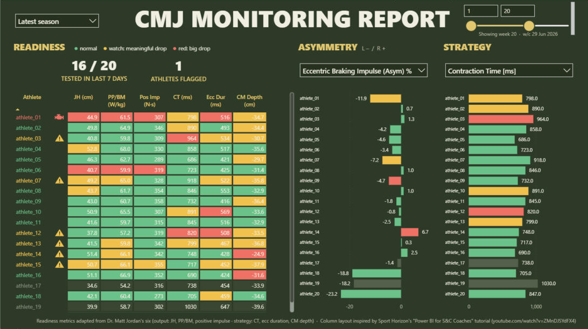
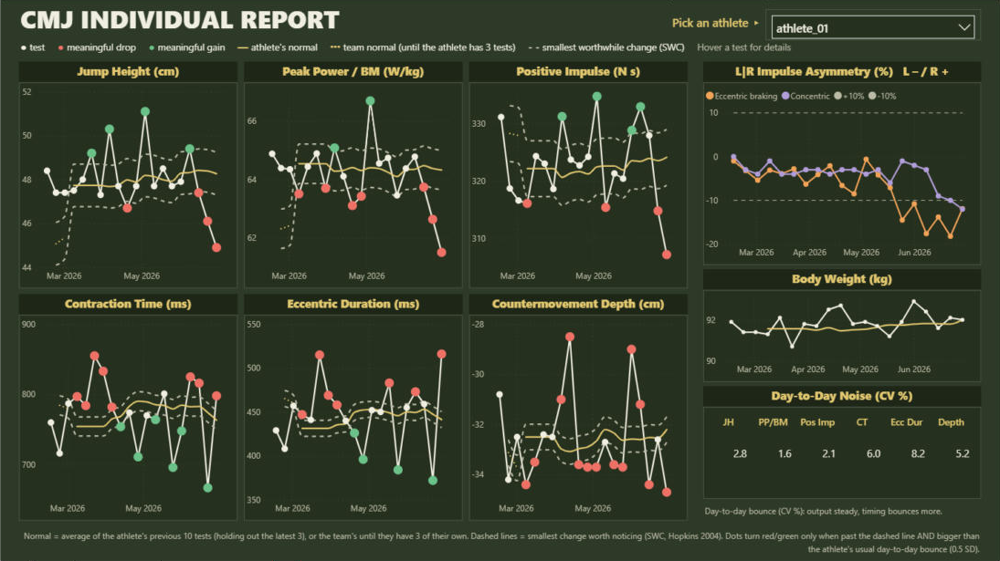

# CMJ Monitoring Report (Power BI)





A plug-and-play Power BI report for countermovement jump (CMJ) monitoring on **VALD ForceDecks or Hawkin Dynamics**. Drop in your exports and it works the way monitoring should: start with the whole team, find who is genuinely off their normal, then zoom in on that athlete.

The idea behind it: **good monitoring isn't reacting to every number, it's being able to tell real change from noise.** Every athlete is compared with their own history, every metric is judged against its own day-to-day noise, and a single red cell is not treated as a flag.

**[Download the report](../../releases/latest)** · **[Getting started: from download to your own data in 5 minutes](docs/GETTING_STARTED.md)**

> **All data in this repo is simulated** for education and portfolio purposes. It doesn't represent any real athlete or organisation.

---

## The two pages

### 1. Team Readiness: who do I need to look at?

A grid of every athlete across six CMJ metrics adapted from Dr. Matt Jordan's, split into what the athlete produced and how they produced it:

| Output | Strategy |
|---|---|
| Jump height | Contraction time |
| Peak power / BM | Eccentric duration |
| Positive impulse | Countermovement depth |

The metrics and the SWC definition were chosen from a [literature review of force plate monitoring research](https://claude.ai/artifact/4DWZuZ3E9y11XL9aAcDjuA) (30 studies on metric reliability, fatigue sensitivity, meaningful change and asymmetry). Jordan's list uses eccentric braking RFD; the review led us to swap it for eccentric duration because RFD is the least reliable CMJ metric (test-retest CVs above 20% in several studies).

Each cell is coloured by how the athlete's latest test compares with their own normal. A cell only changes colour when the change is **worse than the smallest worthwhile change (SWC)** *and* bigger than that athlete's normal test-to-test noise: **green** normal, **amber** worse than the SWC and 0.5–1.5 SD from normal, **red** worse than the SWC and more than 1.5 SD from normal. Red sits at 1.5 SD because Hopkins recommends acting on an individual's change only once it passes about 1.5–2× their normal noise; at 1 SD, roughly 1 test in 6 would turn red by chance alone. Asymmetry and strategy bar charts sit alongside. A **week slider** in the top right lets you look back at any point in the season: drag the right handle and the whole report, both pages, shows the team as it was that week. A **season** dropdown in the top left picks which season the slider and both pages cover; it opens on the latest season. Athletes with fewer than 3 earlier tests show in a muted colour (building baseline) until they have enough history to score.

**Readiness score.** With six metrics, most athletes will show one red cell on any given day just from test-to-test noise, so no single box flags an athlete. Instead, each athlete's name is coloured by a points score built from their six boxes plus their eccentric braking asymmetry, with a caution triangle or check engine light beside the name. A watch (amber) box scores 1 point and a red box 2 points. **Strategy boxes and eccentric braking asymmetry count double** (watch 2, red 4), because the research suggests strategy can shift before output drops (Gathercole et al. 2015; Badby et al. 2025), and an athlete protecting one leg often shows up first as a growing braking asymmetry. Asymmetry is scored on its size compared with the athlete's own normal, whichever side is higher. The maximum is 22.

| Points | Score |
|---|---|
| 0–6 | **Green: fine** |
| 7–11 | **Yellow: caution** (caution triangle beside the name) |
| 12+ | **Red: monitor** (check engine light beside the name). These are the **ATHLETES FLAGGED** count at the top of the page. |

For example: a red asymmetry box plus one amber strategy box and one amber output box = 7 (caution); two red strategy boxes, a red asymmetry box = 12 (monitor). The weights and cut-offs are a practical rule informed by the research, not a validated standard. On the simulated team they put about two-thirds of tests in green, a quarter in yellow and fewer than one in ten in red. On a full real season of team data the split was 56% / 28% / 16%: real data is noisier, so expect to tune the cut-offs. See [Tuning it to your team](#tuning-it-to-your-team).

### 2. Individual Report: what is actually going on?

Pick an athlete from the dropdown (the page stays empty until you do) to see all six metrics across the season. Each chart shows:

- the athlete's **normal** (gold line: the average of their previous tests at that point in the season, see [How the scoring works](#how-the-scoring-works)) and the **SWC band** (normal ± SWC, dashed)
- **flagged tests** (red): worse than the SWC and more than 0.5 SD from normal
- **improved tests** (green): better than the SWC and more than 0.5 SD from normal, a positive adaptation (not shown for countermovement depth, where a change either way is a strategy shift)
- the **team normal** (dotted gold line) while the athlete has fewer than 3 earlier tests of their own: the team's average over the previous 28 days, with the SWC band around it. Tests aren't flagged red or green against it, because comparing one athlete with the team mostly reflects ability, not readiness. Once the athlete has 3 tests, their own normal takes over.

On the right: the **asymmetry trend** (eccentric braking and concentric impulse, ±10% guides), **body weight** with the athlete's normal (relative metrics like PP/BM move with it, so check here before reading a PP/BM drop as lost power), and the athlete's **day-to-day noise** for each metric (CV %).

The CV table is there for a reason. Output metrics are usually quiet (a CV of about 2–3%), while timing and RFD metrics are noisy (often 10% or more). A 5% drop in jump height is a real change; a 5% drop in braking RFD may be an ordinary day.

**The demo case.** `athlete_01` is a simulated case built to show the workflow, shaped on a real patellar tendon case: a stable baseline through spring; from early May he starts braking more off one leg (eccentric braking asymmetry climbing); from mid-May a slower, stiffer countermovement and a slow slide in output that peaks at the end of June; on 20 July his training is adjusted, interventions are added and the IDT gets involved; by late July he is back to baseline. On page 1, drag the week slider back to week 14 (mid-May): athlete_01 already has a caution triangle from asymmetry and strategy (eccentric braking asymmetry red, eccentric duration and depth amber) while jump height still looks normal. He stays on caution through June, and at week 20 (end of June) the check engine light comes on as output drops too. After the intervention he is back to green by week 24.

---

## Quick start

1. Install [Power BI Desktop](https://powerbi.microsoft.com/desktop/) (Windows).
2. Download this repo (**Code → Download ZIP**) and **extract it**. Power BI can't open a project from inside a zip.
3. Open **`CMJMonitoringReport.pbip`** and click **Refresh**.

The simulated demo data is built into the report, so there's nothing to set up.

## Using your own data

1. Export CMJ tests as CSV into a folder, from VALD Hub (ForceDecks) or the Hawkin Dynamics cloud. Make sure the export includes the six metrics, both asymmetry columns and body weight (see [What to include in your export](#what-to-include-in-your-export)). You can keep adding exports over time.
2. In Power BI: **Transform data → Edit parameters** (inside Power Query: **Manage Parameters**).
3. Paste the path into **DataFolder**: either one export file (`C:\Users\you\Documents\CMJ exports\team_cmj.csv`) or a folder of exports (`C:\Users\you\Documents\CMJ exports`). Windows' **Copy as path** works as is, quotes included.
4. **Refresh.** Clear DataFolder at any time to go back to the demo.

| Parameter | What it does |
|---|---|
| `DataFolder` | Blank = built-in demo. A CSV file path = that export. A folder path = every CSV in that folder and its subfolders. If nothing is found there, the refresh stops with a message saying so. |
| `AnonymizeNames` | `true` shows `athlete_01, athlete_02 …` instead of names. Keep this on for screenshots and anything you share. |
| `ExportCulture` | `en-US` for MM/DD/YYYY dates, `en-GB` / `en-AU` for DD/MM/YYYY. |

### VALD and Hawkin

Both systems load into the same columns:

| Report metric | VALD ForceDecks | Hawkin Dynamics |
|---|---|---|
| Jump height (cm) | Jump Height (Imp-Mom) | Jump Height (m → cm) |
| Peak power / BM | Peak Power / BM | Peak Relative Propulsive Power |
| Positive impulse | Positive Impulse | Positive Impulse |
| Contraction time (ms) | Contraction Time | Time To Takeoff (s → ms) |
| Eccentric duration (ms) | Eccentric Duration | Unweighting Phase + Braking Phase (s → ms) |
| Countermovement depth (cm) | Countermovement Depth | Countermovement Depth (m → cm) |
| Asymmetry (L – / R +) | Braking / concentric impulse % (Asym) | L\|R Braking / Propulsive Impulse Index (sign flipped) |

### What to include in your export

Each system lets you choose which metrics go into a CSV export. Include every column in the table above, plus the athlete's name (or ExternalId), the test date and body weight.

- **VALD:** Eccentric Duration isn't in every VALD Hub export template. Add it to your template; until you do, the eccentric duration column stays blank and the athlete is scored on the other five metrics.
- **Hawkin:** include Unweighting Phase and Braking Phase (the report adds them together for eccentric duration). Exports with or without units in the headers both work, in metric or imperial.

A metric that isn't in the export comes through blank rather than breaking the report. Run `tools/check_export.py` (below) to see which columns came through empty.

The two systems detect jump phases slightly differently, so compare athletes within one system rather than across them. Because every athlete is compared with their own history, that doesn't affect the flags.

### Built for real-world exports

- Column order doesn't matter, and extra columns are ignored.
- A missing column comes through blank instead of breaking the refresh.
- Header quirks are handled: trailing spaces, `[unit]` vs `(unit)`, spacing and capitalisation.
- Units are converted: inch exports, and Hawkin's metres, seconds and newtons.
- Files holding several tests keep only bilateral CMJ rows, so SL CMJ, rebound jumps, IMTP and other tests are skipped.
- Overlapping exports are de-duplicated.
- **One row per test.** Hawkin exports every rep as its own row (VALD usually exports one row per test). The import groups the reps of each session (athlete + date), drops any rep whose jump height is more than 10% below that session's best (warm-ups and botched jumps), and averages every metric over the reps that are left. On a full Hawkin season this dropped about 6% of reps. A genuinely bad day still shows, because all of that day's reps are low together.
- Comma or semicolon delimiters and UTF-8 BOMs are detected automatically.
- De-identified exports with no Name column load using the ExternalId instead.
- Year-first dates (2026/09/08) are read correctly whatever `ExportCulture` is set to.

To check an export before opening Power BI:

```
python tools/check_export.py "C:\path\to\your\exports"
```

---

## How the scoring works

For each athlete and metric:

```
z = (test − mean of the athlete's previous tests) / SD of those previous tests
```

- **SWC** (smallest worthwhile change) follows Hopkins (2004) for team sports: **0.2 × the between-athlete SD**, i.e. the spread of every athlete's normal. It answers "is this change big enough to matter?"
- The athlete's own SD answers "is this change bigger than their normal noise?" Most CMJ metrics are noisier than the SWC (contraction time and eccentric duration especially), so a cell needs to pass both tests before it turns amber or red.
- Each metric is scored in the direction that matters: higher is better for jump height, power and impulse; lower is better for contraction time and eccentric duration; a big change in countermovement depth in either direction counts as worse.
- **The normal never includes the test being judged, or the three before it.** It is the athlete's 10 tests before their latest three. Including recent tests in the baseline pulls the normal toward them, so a problem that builds over a few weeks slowly hides itself: in testing on a real season, a braking asymmetry that doubled over two months had crept into a plain 10-test normal by the time it peaked. Holding out the latest three keeps a building problem visible, while the rolling window still lets the normal follow genuine adaptation over a season. (We also tested leaving flagged tests out of the normal instead; it biased every athlete's normal upward and more than doubled the number of check engine lights.)
- Athletes need at least 3 previous tests before they are scored. The three-test hold-out phases in as their history grows.
- The normal starts fresh each season, so off-season changes don't carry into the new season's baseline. Early in a season, athletes show as building baseline until they have 3 tests.
- On page 1 the window ends at the week chosen on the slider; on page 2 every test is compared with the tests before it. Moving the slider never shortens an athlete's baseline.

## Tuning it to your team

The thresholds are sensible starting points, not rules. Everything you might want to change lives in the `Metric Table` measures (Modeling view, or `CMJMonitoringReport.SemanticModel/definition/tables/Metric Table.tmdl`).

| Setting | Where | Default | Change it when |
|---|---|---|---|
| Baseline window | `Baseline Tests` | 10 previous tests | You test more than weekly (use more) or want the normal to follow recent form faster (use fewer). Below about 6 the normal gets noisy. |
| Minimum history | `Min Baseline Tests` | 3 | You want athletes scored sooner, or only once they have a solid baseline. |
| Hold-out | `Baseline Lag` | 3 most recent tests | You want slow build-ups to stand out longer (more) or the normal to react faster (fewer; 0 = plain rolling window). |
| Score cut-offs | `Readiness Score` | 7 caution, 12 monitor | Too many or too few athletes land in yellow and red (see below). |
| Strategy weighting | `Readiness Points` | strategy and eccentric braking asymmetry × 2 | You trust strategy or asymmetry changes more or less on your team. |
| Box thresholds | `level …` measures | watch 0.5 SD, red 1.5 SD | Your team's data is noisier or steadier than typical. |
| SWC | `SWC …` measures | 0.2 × between-athlete SD | You prefer a different smallest worthwhile change. |
| Rep cut-off | `RepDropPercent` in `queries/CMJ Data.m` (Transform data → Advanced Editor on `CMJ Data`) | 10% below the session's best jump | Set it to 100 to average every rep. On our test season, averaging every rep was marginally steadier from session to session (jump height 3.4% vs 3.9%, other metrics within 0.2%), because more reps average out rep-to-rep noise. The cut-off keeps one warm-up or botched rep from setting the session value. If you change it, change `REP_DROP_PERCENT` in `tools/check_export.py` to match. |
| Season start | `SeasonStartMonth` in the `Season Year` column (`CMJ Data` table) | 11 (November) | Your season runs on a different calendar, for example 8 for a hockey season or 1 for calendar years. Tests from this month onward count toward the next season. |

**A simple way to tune the score cut-offs:**

1. Load at least 8–10 weeks of your own testing.
2. Step the as-of date back through a few normal weeks and note how many athletes are yellow and red each week.
3. As a rough target, most of the team should be green in a normal week, with a handful in yellow and only one or two in red. If red is the norm, nobody will act on it.
4. Raise the cut-offs if too many athletes are flagged, lower them if athletes you know were struggling never showed up.
5. Check it against what you already know: soreness, missed sessions, injuries and coach notes. Over a season, the score should light up before or alongside those, not after.

If you change the baseline window or hold-out, also update the caption at the bottom of page 2, which says "previous 10 tests (holding out the latest 3)".

## Repo contents

```
CMJMonitoringReport.pbip            open this in Power BI Desktop
CMJMonitoringReport.Report/         report pages and visuals (Power BI project format)
CMJMonitoringReport.SemanticModel/  tables, relationships and DAX measures (TMDL)
queries/                            readable copies of the Power Query (M) code
sample_data/                        the simulated season as a ForceDecks CSV (built into the report)
                                    and the same season as a Hawkin Dynamics CSV
tools/make_demo_data.py             how the simulated data is generated
tools/build_model.py                copies queries/*.m and the demo CSV into the model after edits
tools/check_export.py               checks a VALD or Hawkin export against the import rules
```

## How the demo data is built

`tools/make_demo_data.py` simulates a season of weekly CMJ testing for 20 athletes from scratch, not from any real dataset:

- Each athlete gets traits for bodyweight, jump ability, countermovement strategy and side bias.
- Metrics are physically linked: takeoff velocity from jump height (impulse–momentum), concentric force from bodyweight, velocity and depth (work–energy), stiffness from force over depth.
- The season has a pre-season build and a mild mid-summer dip.
- Four return-to-play athletes start mid-season about 20% down, with asymmetries that close over time.
- Test-to-test noise is in line with typical CMJ reliability: about 2–3% for output metrics and 6–15% for timing and RFD metrics.
- `athlete_01` follows the simulated case described above.

## Credits and further reading

- The full evidence behind the report's design: [Force Plate Monitoring: Literature Review](https://claude.ai/artifact/4DWZuZ3E9y11XL9aAcDjuA).
- Metric selection is adapted from Dr. Matt Jordan's six CMJ monitoring metrics, with eccentric duration in place of eccentric braking RFD. See also Bishop C, Turner A, Jordan M, et al. *A framework to guide practitioners for selecting metrics during the countermovement and drop jump tests.* Strength and Conditioning Journal 44(4) (2022).
- Smallest worthwhile change (0.2 × between-athlete SD) and interpreting individual change: Hopkins WG. *How to interpret changes in an athletic performance test.* Sportscience 8 (2004).
- RFD reliability: Anicic Z, et al. *Assessment of countermovement jump: what should we report?* Life 13(1):190 (2023); Shaw T, et al. International Journal of Strength and Conditioning 6(1) (2026).
- The page 1 column layout is inspired by the CMJ team report in Sport Horizon's tutorial [Power BI for Strength & Conditioning (S&C) Coaches: Tutorial & Course Discount!](https://www.youtube.com/watch?v=ZMnDJSYdFX4). For more of their Power BI education for coaches and sport scientists, see [sporthorizon.co.uk](https://www.sporthorizon.co.uk/).
- This report grew out of my earlier [CMJ Trend Report](https://github.com/NateKolbSportScience/CMJ-Trend-Report).

## Privacy

Keep real exports outside the repo, or in `data/`, `exports/` or `private/`, which `.gitignore` excludes along with Power BI's local data cache. Leave `AnonymizeNames = true` for screenshots and anything you share.

---

Built by **Nate Kolb**, MSc, RSCC, CPSS · strength and conditioning coach and sport scientist
