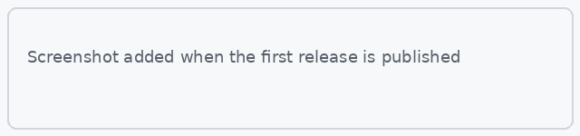
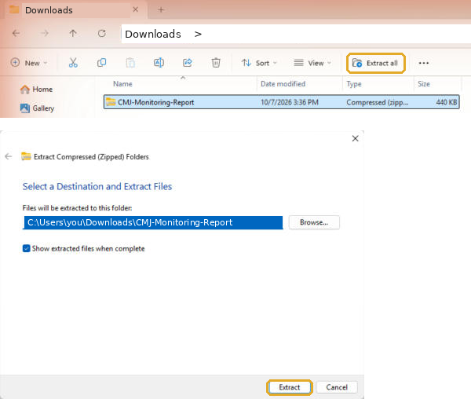
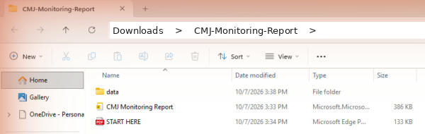
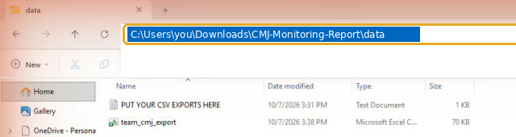
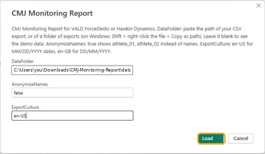
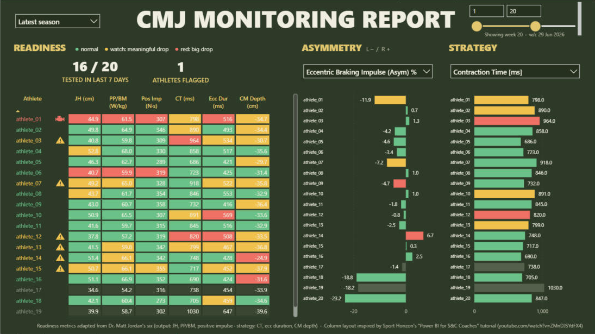
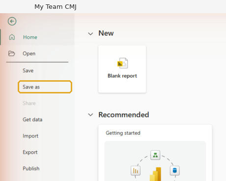
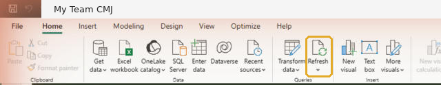

# Getting started

From download to your own team's report in about 5 minutes. No coding, nothing to install except Power BI.

> **You need Windows.** Power BI Desktop only runs on Windows. On a Mac, use a Windows PC or a Windows virtual machine (for example Parallels).

---

## 1. Install Power BI Desktop

It's free: [Power BI Desktop](https://powerbi.microsoft.com/desktop/) (or search "Power BI Desktop" in the Microsoft Store).

## 2. Download the report

Click **[Download the latest version](../../../releases/latest)** and download **`CMJ-Monitoring-Report.zip`**.



Right-click the zip → **Extract All** → choose somewhere easy, like your Documents folder.



You get one folder:

```
CMJ-Monitoring-Report/
├── CMJ Monitoring Report.pbit   the report
├── data/                        put your CSV exports here
└── START HERE.pdf               this guide
```



## 3. Export your CMJ data

Export your countermovement jump tests as a **CSV** and save the file into the **`data`** folder.

Before you export, set up your export template (VALD Hub) or export settings (Hawkin) so the CSV includes these columns. The names are what each system calls them.

**Required: the six metrics, plus who and when**

| Report metric | VALD ForceDecks (VALD Hub) | Hawkin Dynamics |
|---|---|---|
| Athlete | Name | Name |
| Test date | Date | Date |
| **Jump height** | Jump Height (Imp-Mom) | Jump Height |
| **Peak power / body mass** | Peak Power / BM | Peak Relative Propulsive Power |
| **Positive impulse** | Positive Impulse | Positive Impulse |
| **Contraction time** | Contraction Time | Time To Takeoff |
| **Eccentric duration** | Eccentric Duration | Unweighting Phase **and** Braking Phase (the report adds them together) |
| **Countermovement depth** | Countermovement Depth | Countermovement Depth |

**Recommended: asymmetry and body weight**

| Report metric | VALD ForceDecks (VALD Hub) | Hawkin Dynamics |
|---|---|---|
| Eccentric (braking) asymmetry | Eccentric Braking Impulse % (Asym) | L\|R Braking Impulse Index |
| Concentric (propulsive) asymmetry | Concentric Impulse % (Asym) | L\|R Propulsive Impulse Index |
| Body weight | BW [KG] (or Bodyweight in Pounds) | System Weight |
| Test type (only if the file holds other tests too) | Test Type | Type |

Good to know:

- **Any units work.** cm, inches or metres; ms or seconds; kg, lb or newtons. The report converts them.
- **Extra columns are fine.** Anything not in these tables is ignored.
- **A missing metric doesn't break anything.** That column stays blank and the athlete is scored on the rest. VALD's **Eccentric Duration** isn't in every export template, so check it's there.
- **Hawkin exports every rep.** That's fine: the report drops any rep more than 10% below that day's best jump and averages the rest into one value per test.
- **Only bilateral CMJs are used.** If your export also has single-leg jumps, IMTPs or other tests, they're skipped automatically.

## 4. Copy the data folder's path

Open the `data` folder, click the address bar at the top of the window, and copy it (Ctrl + C).



## 5. Open the report

Double-click **`CMJ Monitoring Report.pbit`**. Power BI opens and asks for three settings. The boxes start empty, so fill in all three:

| Setting | What to enter |
|---|---|
| **DataFolder** | Paste the path you copied (Ctrl + V). |
| **AnonymizeNames** | `false` to see your athletes' names, `true` to show `athlete_01, athlete_02 …` (handy for screenshots). |
| **ExportCulture** | `en-US` if your dates are MM/DD/YYYY, `en-GB` if they are DD/MM/YYYY. |

Click **Load**. The first load takes a minute or two for a full season.





## 6. Save your report

**File → Save As** and save it as a normal report (for example `My Team CMJ.pbix`) in the same folder. From now on, open this file, not the `.pbit`.



---

## Every week after that

1. Export the new tests and save the CSV into the `data` folder.
2. Open your saved report.
3. Click **Refresh** (Home tab).



That's it. Old exports can stay in the folder; tests that appear in more than one file are only counted once.

## If something goes wrong

| What you see | What to do |
|---|---|
| "No CMJ exports found" / "Nothing to load at …\\data" | There's no CSV where DataFolder points, often because the `data` folder is still empty. Save your export into the `data` folder and click **Refresh**. If the path itself is wrong, copy it again (step 4) and set it under **Transform data → Edit parameters → DataFolder**. To see the built-in demo instead, clear DataFolder. |
| A column is blank (often eccentric duration on VALD) | That metric isn't in your export. Add it to your VALD Hub export template and export again. |
| Dates look wrong (tests in the wrong month) | Change **ExportCulture** under **Transform data → Edit parameters**. |
| "Some of the tables have incomplete or no data" | Click **Refresh now** on the yellow bar. Big files sometimes need a second refresh. |

Want to know how the scoring works, or tune it to your team? See the [main README](../README.md).
